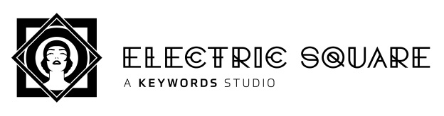

# Raymarching Workshop Course Outline



Brought to you by [Electric Square](https://www.electricsquare.com/)

### Overview
Rendering images involves determining a colour for every pixel on the screen. To compute a colour one must determine what surface lies behind the pixel in the world, and then 'shade' it to compute a final colour.

Current generation GPUs take triangle meshes as input, rasterise them into pixels (called _fragments_ before they're drawn to a display), and then shade them to calculate their contribution to the image. While this pipeline is currently ubiquitous, it is also complicated and not necessarily the best way to learn graphics.

An alternative approach is to cast a ray through each pixel and intersect it with the surfaces in the scene, and then compute the shading.

This course introduces one technique for raycasting through 'distance fields'. A distance field is a function that returns how close a given point is to the closest surface in the scene. This distance defines the radius of a sphere of empty space around each point. Signed distance fields (SDFs) are distance fields that are defined both inside and outside objects; if the queried position is 'inside' a surface, its distance will be reported as negative, otherwise it will be positive.

### What's possible with ray marching?
The game 'Claybook' solely uses distance fields to represent the scene. This affords it a lot of interesting possibilities, like completely dynamic surface topologies and shape morphing. These effects would be very difficult to achieve with triangle meshes. Other benefits include high quality soft shadows and ambient occlusion.


https://www.claybookgame.com/

The following image was also rendered in real-time using the techniques we'll cover today (plus many fancy techniques which we won't have time to dive into).


You can run it live in your browser here: https://www.shadertoy.com/view/ld3Gz2

By using an SDF, the geometry for this scene didn't have to be created in a DCC like Maya, but instead is represented entirely parametrically. This makes it trivial to animate the shape by simply varying the inputs to the scene mapping function. 

Other graphical effects are made simpler by raymarching when compared with the traditional rasterization alternatives. Subsurface scattering, for instance, requires simply sending a few extra rays into the surface to see how thick it is. Ambient occlusion, anti-aliasing, and depth of field are three other techniques which require just a few extra lines and yet greatly improve the image quality.

### Raymarching distance fields
We will march along each ray and look for an intersection with a surface in the scene. One way to do this would be to start at the ray origin (on the camera plane), and take uniform steps along the ray, evaluating the distance field at each point. When the distance to the scene is less than a threshold value, we know we have hit a surface and we therefore we can then terminate the raymarch and shade that pixel.

A more efficient approach is to actually use the sampled distance to the scene at each point along the ray to determine the next step size. As mentioned above, the distance can be regarded as the radius of a sphere of empty space around each point. It is therefore safe to step by this amount because we know we will not pass through any surfaces.

In the following image each black dot represents where the scene was sampled. The ray is then marched along that distance (extending to the radius of the circle) and then resampled.

As you can see, sampling the SDF doesn't give you the exact intersection point of your ray, but rather a minimum distance you can travel without passing through a surface.

Once this distance is below a certain threshold we can stop iterating and shade based on the surface we hit.


Play around with this shader in your browser here: https://www.shadertoy.com/view/lslXD8

### Comparison to ray tracing
At this point one might ask why we don't just compute the intersection with the scene directly using analytic mathematics, using a technique referred to as Ray Tracing. This is how offline renders would typically work - all the triangles in the scene are indexed into some kind of spatial data structure like a Bounding Volume Hierarchy (BVH) or kD-tree, which allow efficient intersection of triangles situated along a ray.

We raymarch distance fields instead because:
- It's very simple to implement the ray casting routine
- We avoid all of the complexity of implementing ray-triangle intersections and BVH data structures
- We don't need to author the explicit scene representation - triangle meshes, tex coords, colours, etc
- We benefit from a range of useful features of distance fields, some of which are mentioned above

Having said the above, there are some nice/elegant/simple entry points into ray tracing. [The Ray Tracing in One Weekend free book](http://in1weekend.blogspot.com/2016/01/ray-tracing-in-one-weekend.html) (and [subsequent](http://in1weekend.blogspot.com/2016/01/ray-tracing-second-weekend.html) [chapters](http://in1weekend.blogspot.com/2016/03/ray-tracing-rest-of-your-life.html)) are very highly recommended and are essential reading for anyone interested in graphics.


## Let's begin!
### 0. ShaderToy
ShaderToy is a shader creation website and platform for browsing, sharing and discussing shaders.

While you can jump straight in and start writing a new shader without creating an account, this is dangerous as you can easily lose work if there are connection issues or if you hange the GPU (easily done by e.g. creating an infinite loop).
Therefore we strongly recommend creating an account (it's fast/easy/free) by heading here: https://www.shadertoy.com/signin, and saving regularly.

For a ShaderToy overview and getting started guide, we recomend following a tutorial such as this one from @The_ArtOfCode: https://www.youtube.com/watch?v=u5HAYVHsasc. The basics here are necessary to follow the rest of the workshop.


### 2D SDF demo

We provide a simple framework for defining and visualizing 2D signed distance fields.

https://www.shadertoy.com/view/llcBD2

Prior to defining the distance field the result will be all white. The goal of this section is to design an SDF that gives the desired scene shape (white outline). In code this distance is computed by the `sdf()` function, which is provided a 2D position in space. The concepts you learn here will generalise directly to 3D space and will allow you to model a 3D scene.

Start simple - try first to just use the x or y component of the point `p` and observe the result:

```cpp
float sdf(vec2 p)
{
    return p.y;
}
```

The result should look as follows:


Green denotes 'outside' surfaces, red denotes 'inside' surfaces, the white line delineates the surface itself, and the shading in the inside/outside regions illustrates distance iso-lines - lines at fixed distances. In 2D this SDF models a horizontal line in 2D at `y=0`. What sort of geometric primitive would this represent in 3D?

Another good thing to try is to use distances, for example: `return length(p);`. This operator returns the magnitude of the vector, and in this case it's giving us the current point's distance to the origin.

A point is not a very interesting thing to render as a point is infinitesimal, and our rays would always miss it!
We can give the point some area by subtracting the desired radius from the distance: `return length(p) - 0.25;`.
A final extension is to change the point from which we compute the distance: `length(p - vec3(0.0, 0.2, 0.0)) - 0.25;`.
What effect does this have on the shape?
What values might the function be returning for points 'inside' the circle?

Congratulations - you have just modelled a circle using mathematics :). This will trivially extend to 3D in which case it models a sphere. Contrast this scene representation to other 'explicit' scenes representations such as triangle meshes or NURBS surfaces. We created a sphere in minutes with a single line of code, and our code directly maps to one mathematical definition for a sphere - 'the set of all points that are equidistant from a center point'.

For other types of primitives, the distance functions are similarly elegant. iq made a great reference page with images: http://iquilezles.org/www/articles/distfunctions/distfunctions.htm

Once you understand how a distance to a primitive works - put it in a box - define a function for it so you don't need to remember and write out the code each time. There is a function already defined for the circle `sdCircle()` which you can find in the shader. Add any primitives you wish.

### Combining shapes
Now we know how to create individual primitives, how can we combine them to define a scene with multiple shapes?

One way to do this is the 'union' operator - which is defined as the minimum of two distances. It's best to experiment with the code in order to get a strong grasp of this, but the intuition is that the SDF gives the distance to the nearest surface, and if the scene has multiple objects you want the distance to the closest object, which will be the minimum of the distances to each object.

In code this may look as follows:

```cpp
float sdf(vec2 p)
{
    float d = 1000.0;
    
    d = min(d, sdCircle(p, vec2(-0.1, 0.4), 0.15));
    d = min(d, sdCircle(p, vec2( 0.5, 0.1), 0.35));
    
    return d;
}
```

In this way we can compactly combine many shapes. Once this is understood, the `opU()` function should be used, which stands for 'operation union'.

This is only scratching the surface of what is possible. We can get smooth blends using a fancy soft min function - try using the provided `opBlend()`. There are many other interesting techniques that can be applied, the interested reader is referred to this extended introduction to building scenes with SDFs: https://www.youtube.com/watch?v=s8nFqwOho-s

Example:


## 1. Transition to 3D
Hopefully you've gained a basic understanding of how distance fields can be used to represent scene data, and how we'll use raymarching to find intersection points with the scene. We're now going to start working in three dimensions, where the real magic happens.

We reccommend saving your current shader and starting a new one so that you can refer back to your 2D visualization later. Most of the helpers can copied into your new shader and made to work in 3D by swapping the `vec2`s with `vec3`s.

### 1.a. Ray marching loop
Rather than visualize the SDF like we did in 2D, we're going to jump right in to rendering the scene. Here's the basic idea of how we'll implement ray marching (in pseudo code):

```
Main
    Evaluate camera
    Render ray

Render ray
    Raymarch to find intersection
    Shade
```

These steps will now each be described in more detail.

### 1.b. Camera
```cpp
vec3 getCameraRayDir(vec2 uv, vec3 camPos, vec3 camTarget)
{
    // Calculate camera's "orthonormal basis", i.e. its transform matrix components
    vec3 camForward = normalize(camTarget - camPos);
    vec3 camRight = normalize(cross(vec3(0.0, 1.0, 0.0), camForward));
    vec3 camUp = normalize(cross(camForward, camRight));
     
    float fPersp = 2.0;
    vec3 vDir = normalize(uv.x * camRight + uv.y * camUp + camForward * fPersp);
 
    return vDir;
}
```

This function calculates the three axes of the camera's 'view' matrix (forward, right, and up vectors), and then uses them to calculate the direction of the ray for the current pixel (located at `uv` in screen-space).

`fPersp` allows us to indirectly control our camera's field of view. You can think of this multiplication as moving the near plane closer and farther from the camera. Experiment with different values.

### 1.c. Define scene
```cpp
float sdSphere(vec3 p, float r)
{
    return length(p)-r;
}
 
float sdf(vec3 pos)
{
    float t = sdSphere(pos-vec3(0,0,10), 3.0);
     
    return t;
}
```

As you can see, we've added a `sdSphere()` which is identical to `sdCircle` save for the number of components in our input point.

### 1.d. Raymarching
Pseudo code:

```cpp
castRay
    for i in step count:
         sample scene
             if within threshold return dist
    return -1
```

Try to write this yourself - if you get stuck only then take a look at the solution below.

Real code:

```cpp
float castRay(vec3 rayOrigin, vec3 rayDir)
{
    float t = 0.0; // Stores current distance along ray
     
    for (int i = 0; i < 64; i++)
    {
        float res = SDF(rayOrigin + rayDir * t);
        if (res < (0.0001*t))
        {
            return t;
        }
        t += res;
    }
     
    return -1.0;
}
```

For full working program, see Shadertoy: Part 1


We'll add a simple helper transform the screen-space pixel coordinate. We'll flip the y coordinate and bring the range from [0, 1] into [-1, 1].

```cpp
vec2 screenToWorld(vec2 screenCoord)
{
    vec2 result = 2.0 * (screenCoord/iResolution.xy - 0.5);
    result.x *= iResolution.x/iResolution.y;
    return result;
}
```

**Exercises:**
- Experiment with the step count and observe how result degrades.
- Experiment with the termination threshold and observe how result degrades.


### 1.e. Depth
Lets display the distance to the scene to check we're on track. We'll scale and invert it to better see the differences.

```cpp
vec3 col = vec3(1.0-dist*0.075);
```


https://www.shadertoy.com/view/XltBzj


### 1.f. Ambient
To get some colour into the scene we're first going to differentiate between objects and the background.

To do this, we can return -1 in castRay to signal nothing was hit. We can then handle that case in render.

```cpp
vec3 render(vec3 rayOrigin, vec3 rayDir)
{
    vec3 col;
    float t = castRay(rayOrigin, rayDir);
 
    if (t == -1.0)
    {
        // Skybox colour
        col = vec3(0.30, 0.36, 0.60) - (rayDir.y * 0.7);
    }
    else
    {
        vec3 objectSurfaceColour = vec3(0.4, 0.8, 0.1);
        vec3 ambient = vec3(0.02, 0.021, 0.02);
        col = ambient * objectSurfaceColour;
    }
     
    return col;
}
```


https://www.shadertoy.com/view/4tdBzj


### 1.g. Shading (diffuse)
To get more realistic lighting let's calculate the surface normal so we can calculate basic Lambertian lighting.

To calculate the normal, we are going to calculate the gradient of the surface in all three axes.

What this means in practice is sampling the SDF four extra times with slightly offset directions from out primary ray, and using that info to determine the normal.

```cpp
vec3 calcNormal(vec3 pos)
{
    // Center sample
    float c = sdf(pos);
    // Use offset samples to compute gradient / normal
    vec2 eps_zero = vec2(0.001, 0.0);
    return normalize(vec3( sdf(pos + eps_zero.xyy), sdf(pos + eps_zero.yxy), sdf(pos + eps_zero.yyx) ) - c);
}
```

One great way to inspect normals is by displaying them as though they represented color. This is what a sphere should look like when displaying its scaled and biased normal (brought from [-1, 1] into [0, 1])

```cpp
col = N * vec3(0.5) + vec3(0.5);
```


Now that we have a normal, we can take the dot product between it and the light direction.

This will tell us how directly the surface is facing the light and therefore how bright it should be.

We take the max of this value with 0 to prevent negative values from giving unwanted effects on the dark side of objects.

```cpp
// L is vector from surface point to light, N is surface normal. N and L must be normalized!
float NoL = max(dot(N, L), 0.0);
vec3 LDirectional = vec3(0.9, 0.9, 0.8) * NoL;
vec3 LAmbient = vec3(0.03, 0.04, 0.1);
vec3 diffuse = col * (LDirectional + LAmbient);
```

One very important part of rendering which can easily be overlooked is gamma correction. Pixel values sent to the monitor are in gamma space, which is a nonlinear space used to maximise precision, by using less bits in intensity ranges that humans are less sensitive to.

Because monitors don't operate in "linear" space, we need to compensate for their gamma curve prior to outputting a colour. The difference is very noticeable and should always be corrected for. In reality we don't know the gamma curve for a particular display device is, so the whole situation with display technology is an awful mess (hence the gamma tuning step in many games), but a common assumption is the following gamma curve:


The constant 0.4545 is simply 1.0 / 2.2

```cpp
col = pow(col, vec3(0.4545)); // Gamma correction
```


https://www.shadertoy.com/view/4t3fzn


### Shadows
To calculate shadows, we can fire a ray starting at the point we intersected the scene and going in the direction of the light source.

If this ray march results in us hitting something, then we know the light will also be obstructed and so this pixel is in shadow.
```cpp
float shadow = 0.0;
vec3 shadowRayOrigin = pos + N * 0.01;
vec3 shadowRayDir = L;
IntersectionResult shadowRayIntersection = castRay(shadowRayOrigin, shadowRayDir);
if (shadowRayIntersection.mat != -1.0)
{
    shadow = 1.0;
}
col = mix(col, col*0.2, shadow);
```

### Ground plane
Let's add a ground plane so we can see shadows cast by our spheres better.

The w component of n represents the distance the plane is from the origin.

```cpp
float sdPlane(vec3 p, vec4 n)
{
    return dot(p, n.xyz) + n.w;
}
```

### Soft Shadows
Shadows in real life don't immediately stop, they have some falloff, referred to as a penumbra. 

We can model this by taking marching several rays from our surface point, each with slightly different directions.

We can then sum the result and average over the number of iterations we did. This will cause the edges of the shadow to have 

some rays hit, and others miss, giving a 50% darkness.

Finding somewhat pseudo random number can be done a number of ways, we'll use the following though:

```cpp
float rand(vec2 co)
{
  return fract(sin(dot(co.xy ,vec2(12.9898,78.233))) * 43758.5453);
}
```

This function will return a number in the range [0, 1). We know the output is bound to this range because the outermost operation is fract, which returns the fractional component of a floating point number.

We can then use this to calculate our shadow ray as follows:

```cpp
float shadow = 0.0;
float shadowRayCount = 1.0;
for (float s = 0.0; s < shadowRayCount; s++)
{
    vec3 shadowRayOrigin = pos + N * 0.01;
    float r = rand(vec2(rayDir.xy)) * 2.0 - 1.0;
    vec3 shadowRayDir = L + vec3(1.0 * SHADOW_FALLOFF) * r;
    IntersectionResult shadowRayIntersection = castRay(shadowRayOrigin, shadowRayDir);
    if (shadowRayIntersection.mat != -1.0)
    {
        shadow += 1.0;
    }
}
col = mix(col, col*0.2, shadow/shadowRayCount);
```

## 2 Texturing
Rather than define a single surface colour (or other characteristic) uniformly over the entire surface, one can define patterns to apply to the surface using textures.
We'll cover three ways of achieving this.

### 3D
There are volume textures readily accessible in shadertoy that can be assigned to a channel. Try sampling one of these textures using the 3D position of the surface point:

// assign a 3D noise texture to iChannel0 and then sample based on world position
float textureFreq = 0.5;
vec3 surfaceCol = texture(iChannel0, textureFreq * surfacePos).xyz;
One way to sample noise is to add together multiple scales, using something like the following:

```cpp
// assign a 3D noise texture to iChannel0 and then sample based on world position
float textureFreq = 0.5;
vec3 surfaceCol =
    0.5    * texture(iChannel0, 1.0 * textureFreq * surfacePos).xyz +
    0.25   * texture(iChannel0, 2.0 * textureFreq * surfacePos).xyz +
    0.125  * texture(iChannel0, 4.0 * textureFreq * surfacePos).xyz +
    0.0625 * texture(iChannel0, 8.0 * textureFreq * surfacePos).xyz ;
```

The constants/weights above are typically used for a fractal noise, but they can take any desired values. Try experimenting with weights/scales/colours and seeing what interesting effects you can achieve.

Try animating your object using iTime and observing how the volume texture behaves. Can this behaviour be changed?

### 2D
Applying a 2D texture is an interesting problem - how to project the texture onto the surface? In normal 3D graphics, each triangle in an object has one or more UVs assigned which provide the coordinates of the region of texture which should me mapped to the triangle (texture mapping). In our case we don't have UVs provided so we need to figure out how to sample the texture.

One approach is to sample the texture using a top down world projection, by sampling the texture based on X & Z coordinates:

// top down projection
float textureFreq = 0.5;
vec2 uv = textureFreq * surfacePos.xz;
 
// sample texture
vec3 surfaceCol = texture2D(iChannel0, uv).xyz;
What limitations do you see with this approach?


### Triplanar mapping

A more advanced way to map textures is to do 3 projections from the primary axes, and then blend the result using triplanar mapping. The goal of the blending is to pick the best texture for each point on the surface. One possibility is to define the blend weights based on the alignment of the surface normal with each world axis. A surface that faces front on with one of the axes will receive a large blend weight:

```cpp
vec3 triplanarMap(vec3 surfacePos, vec3 normal)
{
    // Take projections along 3 axes, sample texture values from each projection, and stack into a matrix
    mat3 triMapSamples = mat3(
        texture(iChannel0, surfacePos.yz).rgb,
        texture(iChannel0, surfacePos.xz).rgb,
        texture(iChannel0, surfacePos.xy).rgb
        );
 
    // Weight three samples by absolute value of normal components
    return triMapSamples * abs(normal);
}
```


What limitations do you see with this approach?


## 3. Materials
Along with the distance we return from the castRay function, we can also return an index which represents the material of the object hit. We can use this index to colour objects accordingly.

Our operators will need to take vec2s rather than floats, and compare the first component of each.

Now, when defining our scene we'll also specify a material for each primitive as the y component of a vec2:

```cpp
vec2 res =     vec2(sdSphere(pos-vec3(3,-2.5,10), 2.5),      0.1);
res = opU(res, vec2(sdSphere(pos-vec3(-3, -2.5, 10), 2.5),   2.0));
res = opU(res, vec2(sdSphere(pos-vec3(0, 2.5, 10), 2.5),     5.0));
return res;
```

We can then multiply this material index by some values in the render function to get different colours for each object. Try different values out.

```cpp
col = vec3(0.18*m, 0.6-0.05*m, 0.2)
if (m == 2.0)
{
    col *= triplanarMap(pos, N, 0.6);
}
```

Let's colour the ground plane using a checkerboard pattern. I've taken this fancy analytically-anti-aliased checkerbox function from Inigo Quilez' website.

```cpp
float checkers(vec2 p)
{
    vec2 w = fwidth(p) + 0.001;
    vec2 i = 2.0*(abs(fract((p-0.5*w)*0.5)-0.5)-abs(fract((p+0.5*w)*0.5)-0.5))/w;
    return 0.5 - 0.5*i.x*i.y;
}
```

We'll pass in the xz components of our plane position to get the pattern to repeat in those dimensions.


https://www.shadertoy.com/view/Xl3fzn

### Fog
We can add now fog to the scene based on how far each intersection occurred from the camera.

See if you can get something similar to the following:


https://www.shadertoy.com/view/Xtcfzn


Shape & material blending
To avoid the harsh crease given by the min operator, we can use a more sophisticated operator which blends the shapes smoothly.

```cpp
// polynomial smooth min (k = 0.1);
float sminCubic(float a, float b, float k)
{
    float h = max(k-abs(a-b), 0.0);
    return min(a, b) - h*h*h/(6.0*k*k);
}
 
vec2 opBlend(vec2 d1, vec2 d2)
{
    float k = 2.0;
    float d = sminCubic(d1.x, d2.x, k);
    float m = mix(d1.y, d2.y, clamp(d1.x-d,0.0,1.0));
    return vec2(d, m);
}
```


## Advanced techniques
### Anti-aliasing
By sampling the scene many times with slightly offset camera direction vectors, we can get an smoothed value which avoids aliasing.

I've brought out the scene colour calculation out to its own function to make calling it in the loop clearer.

```cpp
float AA_size = 2.0;
float count = 0.0;
for (float aaY = 0.0; aaY < AA_size; aaY++)
{
    for (float aaX = 0.0; aaX < AA_size; aaX++)
    {
        fragColor += getSceneColor(fragCoord + vec2(aaX, aaY) / AA_size);
        count += 1.0;
    }
}
fragColor /= count;
```

### Step count optimization
If we visualize how many steps we take for each pixel in red, we can clearly see that the rays which hit nothing are responsible for most of our iterations.

This can give a significant performance boost for certain scenes.

```cpp
if (t > drawDist) return backgroundColor;
```


### Shape & material interpolation
We can interpolate between two shapes using the mix function and using iTime to modulate over time.

```cpp
vec2 shapeA = vec2(sdBox(pos-vec3(6.5, -3.0, 8), vec3(1.5)), 1.5);
vec2 shapeB = vec2(sdSphere(pos-vec3(6.5, -3.0, 8), 1.5),    3.0);
res = opU(res, mix(shapeA, shapeB, sin(iTime)*0.5+0.5));
```


### Domain repetition
It's quite easy to repeat a shape using a signed distance field, essentially you just have to modulo the input position in one or more dimensions.

This technique can be used for example to repeat a column several times without increasing the scene's representation size.

Here I've repeated all three components of the input position, then used the subtraction operator ( max() ) to limit the repetition to a bounding box.


One gotcha is that you need to subtract half of the value you are modulating by in order to center the repetition on your shape as to not cut it in half.

```cpp
float repeat(float d, float domain)
{
    return mod(d, domain)-domain/2.0;
}
```


## Post processing effects
### Vignette
By darkening pixels which are farther from the center of the screen we can get an simple vignette effect.

### Contrast
Darker and lighter values can be accentuated, causing the perceived dynamic range to increase along with the intensity of the image.

```cpp
col = smoothstep(0.0,1.0,col);
```

### "Ambient Occlusion"
If we take the inverse of the image shown above (in Optimizations), we can get a weird AO-like effect.

```cpp
col *= (1.0-vec3(steps/maxSteps));
```

### Ad infinitum
As you can see, many post processing effects can implemented trivially; play around with different functions and see what other effects you can create.


## What's next?
We've just covered the basics here; there is much more to be explored in this field such as:

- Subsurface scattering
- Ambient occlusion
- Animated primitives
- Primitive warping functions (twist, bend, ...)
- Transparency (refraction, caustics, ...)
- Optimizations (bounding volume hierarchies)
- ...

Browse ShaderToy to get some inspiration about what can be done and poke through various shaders to see how different effects are implemented.

Many shaders have variables which you can tweak and instantly see the effects of (alt-enter is the shortcut to compile!).

Also give the references a read through if you're interested in learning more!


Thanks for participating! Be sure to send me your cool shaders! If you have any feedback on the course I'd also love to hear it!

Contact us on twitter [@liqwidice](https://twitter.com/liqwidice) & [@hdb1](https://twitter.com/hdb1)

---

### Recommended reading:

SDF functions: http://jamie-wong.com/2016/07/15/ray-marching-signed-distance-functions/

Claybook demo: https://www.youtube.com/watch?v=Xpf7Ua3UqOA

Ray Tracing in One Weekend: http://in1weekend.blogspot.com/2016/01/ray-tracing-in-one-weekend.html

Physically-based rendering bible, PBRT: https://www.pbrt.org/

Primitives reference: http://iquilezles.org/www/articles/distfunctions/distfunctions.htm

Extended introduction to building scenes with SDFs: https://www.youtube.com/watch?v=s8nFqwOho-s

Very realistic lighting & colours: http://www.iquilezles.org/www/articles/outdoorslighting/outdoorslighting.htm
